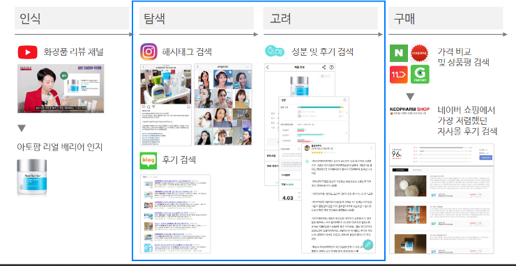

# ReviewTwits

## 프로젝트 설명
저희가 개발할 프로젝트는 `ReviewTwits` 입니다.

모든 프로젝트 관련 내용은 [해당 노션 페이지](https://ghdic.notion.site/ReviewTwits-7790d8401abd45959a31d5e9e2a38bd7)에 작성 됩니다.

ReviewTwits는 “새처럼 지저귄다”라는 뜻을 가진 Twitter 서비스의 어미를 따온것으로

Disqus댓글 서비스처럼 리뷰 서비스를 간단한 html코드나 라이브러리로

타사이트에 리뷰기능을 붙이는것을 목표로 합니다.

온라인 쇼핑몰 시장이 커지면서 리뷰시스템이 필요한 경우가 되게 많은데요

구현하기 까다로운 리뷰 기능을 제공하고 리뷰를 통합함으로써

다양한 형태로 리뷰를 노출할 수 있도록 개발할 예정입니다.

저희 서비스가 목표로 하는 포지션을 아래와 같습니다.

