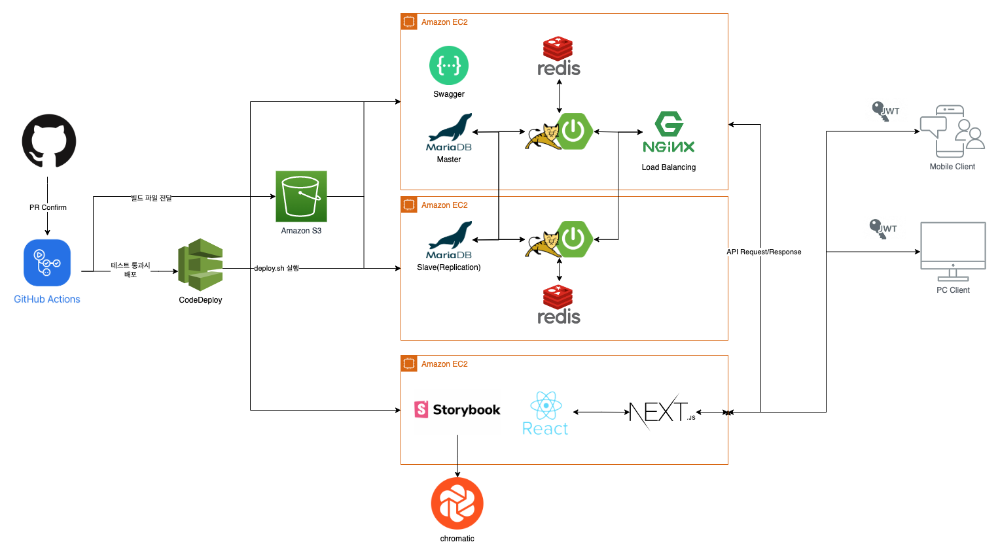

# ReviewTwits : BackEnd

ReviewTwits 백엔드 레포입니다

저희가 개발하는 프로젝트는 `ReviewTwits` 입니다.

`ReviewTwits`는 “새처럼 지저귄다”라는 뜻을 가진 `Twitter` 서비스의 어미를 따온것으로

소비자들이 제품이나 서비스에 대한 경험을 공유하는 작은 지저귐이 보여줄 가능성을 표출하는 플랫폼입니다.

소비자는 언제나 값을 지불 해야지만 자신이 생각했던 제품인지 알 수 있는 불리한 포지션에 놓여 있습니다.

통합된 리뷰를 통해 구매에 대한 고민을 줄이고 생각했던것과 다른 제품을 사는 시행착오를 줄일 수있게 도움을 줄 수 있는 플랫폼을 만들고자 합니다.

저희 서비스가 목표로 하는 포지션은 아래와 같습니다.

소비자가 제품을 인식을 하고 구매하기까지에 필요한 제품에 대한 정보와 후기를 플랫폼에서 제공하고자 합니다.

## System Architecture

백엔드에서는 Git Action 을 통해 CI/CD 를 구축하였습니다.

백앤드 개발자가 개발한 코드를 

